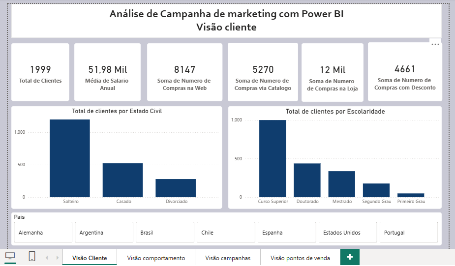
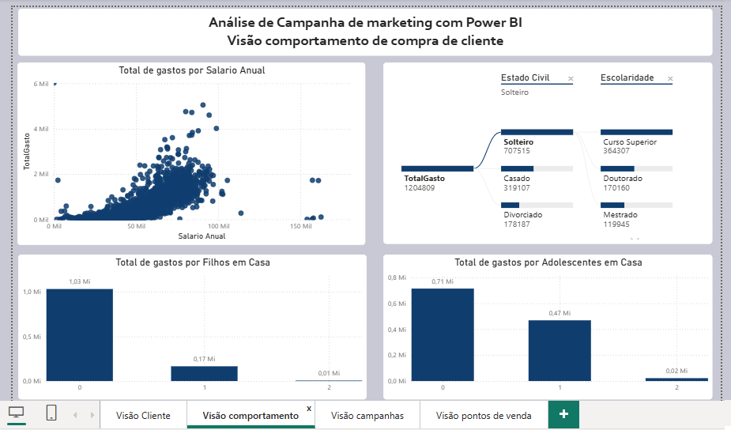
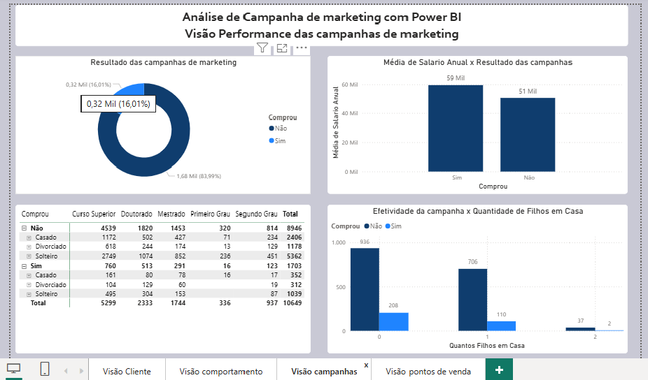
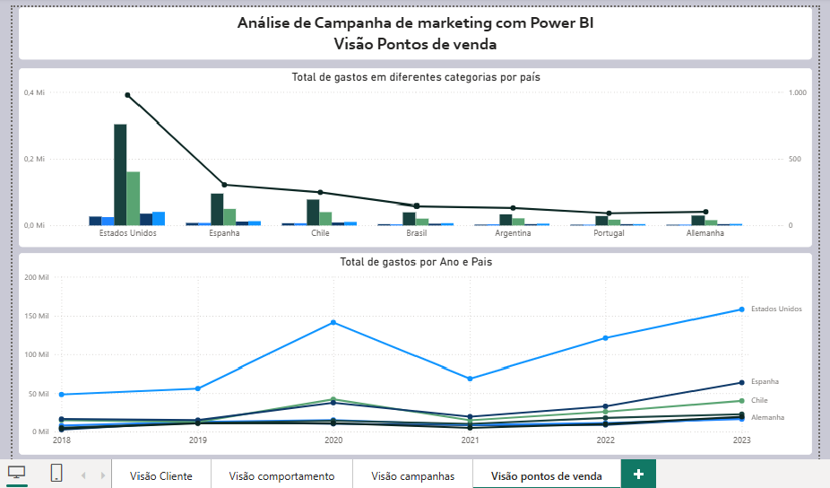

# 📢 Dashboard de Análise de Campanhas de Marketing

## 📖 Sobre o Projeto

Este projeto consiste em um dashboard interativo desenvolvido no **Power BI Desktop** para análise de campanhas de marketing, comportamento dos clientes e desempenho dos pontos de venda.

O relatório foi criado com o objetivo de transformar dados de clientes e campanhas em informações estratégicas para apoiar decisões relacionadas ao marketing, vendas e relacionamento com o cliente.

O dashboard está dividido em quatro páginas, permitindo uma análise detalhada sob diferentes perspectivas.

---

## 🎯 Objetivos

- Avaliar a efetividade das campanhas de marketing.
- Conhecer o perfil dos clientes.
- Analisar o comportamento de compra.
- Comparar gastos por país e por ponto de venda.
- Identificar padrões que influenciam as compras.
- Apoiar decisões estratégicas baseadas em dados.

---

# 📊 Estrutura do Dashboard

## 👤 Visão do Cliente

Nesta página são apresentados os principais indicadores relacionados ao perfil dos clientes.

### KPIs

- Total de Clientes
- Média de Salário Anual
- Compras via Web
- Compras por Catálogo
- Compras em Loja Física
- Compras com Desconto

Também são disponibiladas análises por:

- Estado Civil
- Escolaridade
- País

Essa visão permite compreender melhor o público atendido pela empresa.

---

## 🛒 Visão do Comportamento de Compra

Esta página explora o comportamento de consumo dos clientes.

As análises incluem:

- Relação entre salário anual e gastos
- Total de gastos por quantidade de filhos
- Total de gastos por adolescentes na residência
- Decomposição dos gastos utilizando o visual **Árvore de Decomposição (Decomposition Tree)**

Esse conjunto de informações permite identificar perfis de clientes com maior potencial de consumo.

---

## 📢 Visão das Campanhas de Marketing

Página destinada à avaliação dos resultados das campanhas.

Principais análises:

- Percentual de clientes que realizaram compras após a campanha
- Média salarial dos clientes que compraram e dos que não compraram
- Efetividade das campanhas considerando quantidade de filhos
- Comparativo entre escolaridade, estado civil e resposta às campanhas

Essa análise auxilia na identificação do público com maior propensão à conversão.

---

## 🏪 Visão dos Pontos de Venda

Painel voltado para análise geográfica e comercial.

Permite visualizar:

- Gastos por país
- Evolução dos gastos ao longo dos anos
- Comparação entre diferentes regiões
- Tendência de crescimento das vendas

Essa visão facilita o acompanhamento do desempenho comercial em diferentes mercados.

---

# 🛠️ Ferramentas Utilizadas

- Power BI Desktop
- Power Query
- DAX
- Modelagem de Dados
- KPIs
- Árvore de Decomposição
- Segmentações de Dados
- Storytelling com Dados
- Visualizações Interativas

---

# 📌 Indicadores Monitorados

- Total de Clientes
- Média Salarial
- Compras por Canal
- Compras com Desconto
- Efetividade das Campanhas
- Gastos por Cliente
- Gastos por País
- Gastos por Ano
- Perfil dos Clientes
- Conversão das Campanhas

---

# 💡 Principais Insights

O dashboard possibilita identificar:

- Perfil dos clientes com maior potencial de compra.
- Eficiência das campanhas de marketing.
- Relação entre renda e comportamento de consumo.
- Influência da escolaridade e estado civil nas compras.
- Países com maior volume de vendas.
- Evolução das receitas ao longo dos anos.
- Oportunidades para otimização das campanhas de marketing.

---

# 📂 Estrutura do Projeto

```
PowerBI-Dashboard-Marketing/
│
├── Dashboard_Marketing.pbix
├── README.md
├── dataset
│   └── Base_Marketing.xlsx
│
└── screenshots
    ├── cliente.png
    ├── comportamento.png
    ├── campanhas.png
    └── pontos-venda.png
```

---

# 📷 Dashboard

## 👤 Visão do Cliente



---

## 🛒 Visão do Comportamento de Compra



---

## 📢 Visão das Campanhas



---

## 🏪 Visão dos Pontos de Venda



---

# 🚀 Como visualizar

1. Faça o download do arquivo `.pbix`.
2. Abra o projeto utilizando o **Power BI Desktop**.
3. Explore as páginas do relatório e utilize os filtros para analisar diferentes cenários.

---

# 🎓 Competências Demonstradas

Durante o desenvolvimento deste projeto foram aplicados conhecimentos em:

- ✔️ Business Intelligence (BI)
- ✔️ Análise de Dados
- ✔️ Marketing Analytics
- ✔️ Modelagem de Dados
- ✔️ Criação de KPIs
- ✔️ Desenvolvimento de Medidas em DAX
- ✔️ Transformação de Dados com Power Query
- ✔️ Storytelling com Dados
- ✔️ Segmentação de Clientes
- ✔️ Visualização Interativa
- ✔️ Análise de Comportamento do Consumidor

---

# 👨‍💻 Autor

**José Rafael Santos Pereira**

Analista de Sistemas | Power BI | SQL | Python | Flutter | Business Intelligence


GitHub: https://github.com/ZeRafaSp/

LinkedIn: https://www.linkedin.com/in/rafaelsantospereirarsp/


